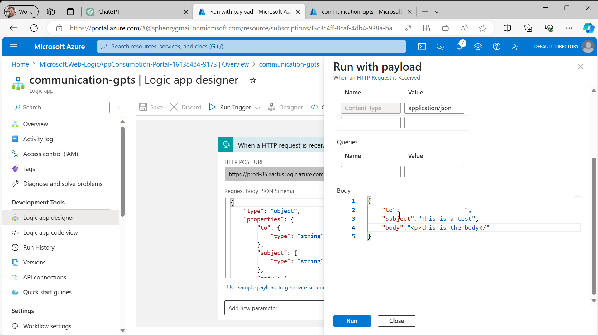

# Send Email from Your GPTs in 15 Mins with Azure Communication Services, and No Code!

Sending emails through Azure Communication Services is surprisingly straightforward and requires no coding expertise. Here's how you can set it up in just 15 minutes.

## Step 1: Create an Azure Communication Service Resource
First, you need to create an Azure Communication Service Resource. Follow the instructions on the [Create Azure Communication Services resource](https://learn.microsoft.com/en-us/azure/communication-services/quickstarts/create-communication-resource?tabs=windows&pivots=platform-azp) to get started.

Copy the connection string from the Keys blade of your Communication resource. You'll need it later.

## Step 2: Create an Email Service
Next, create an Email Service by following this [Create the Email Communications Service resource using portal](https://learn.microsoft.com/en-us/azure/communication-services/quickstarts/email/create-email-communication-resource).


## Step 3: Set Up a Free Azure Subdomain
Back in the Communication resource, select 'Try Email'. Under 'Select a domain', choose 'Set up a free Azure subdomain' and select the email service you just created.

Use the 'Try email' feature to ensure that your setup is working correctly. Copy and save somewhere the 'Send email from' address. You'll need it later.

## Step 4: Create a Logic App Resource
Now, search and create a new 'Logic App' resource in your Azure portal. In the Logic App designer, select 'When an HTTP request is received'.


## Step 5: Define JSON Payload
In the designer, click 'use sample payload', and add a JSON payload with "to", "subject", and "content". Then click "done".
```json
{
"to" : "test@example.com",
"subject" : "subject" ,
"body" : "email body"
}
```


## Step 6: Add Send Email Operation
Add a 'New step', search for "communication email" and add the 'send email' operation. Give it the connection name 'Email' and paste the Connection string from the Communication resource Keys blade. Click 'Create'.


## Step 7: Set Email Parameters
Set the 'from' field to the email address found on the 'Try email' page. Set 'To Email' to the 'to' field, 'Subject' to 'subject', and for 'body', select 'see more' and add 'content'.


## Step 8: Test Your Setup
Click save, then 'Run Trigger with Payload'. Test it with a JSON payload containing "to", "subject", and "body" fields.


## Step 9: Integrate with OpenAI GPTs
At [OpenAI GPTs editor](https://chat.openai.com/gpts/editor), click 'new GPT' and 'configure'. Name it "Email Sender" and set the description and instructions as mentioned.
```
Compose wonderful emails and send them
```
```
You are a GPT the help people write emails and send them. Before you send any emails show a preview and confirm that you will send it
```


## Step 10: Add Actions and JSON Schema
Click 'Add actions' in your GPT configuration. Enter the following JSON, substituting for the URL and the paths value from the URL in the logic app designer:

```json
{
  "openapi": "3.1.0",
  "info": {
    "title": "Send Message API",
    "description": "API for sending a message to a specified email address.",
    "version": "v1.0.0"
  },
  "servers": [
    {
      "url": "https://<<logic app url>>.azure.com"
    }
  ],
  "paths": {
    "/workflows/9a83a...&sig=ePEB-srbi-XXXXXXXXXXXXXXXXXXXXXXXX" : {
      "post": {
        "description": "Send a message to a given email address",
        "operationId": "SendMessage",
        "requestBody": {
          "required": true,
          "content": {
            "application/json": {
              "schema": {
                "type": "object",
                "properties": {
                  "to": {
                    "type": "string",
                    "format": "email",
                    "description": "Email address of the recipient"
                  },
                  "subject": {
                    "type": "string",
                    "description": "The message subject"
                  },
                  "content": {
                    "type": "string",
                    "description": "The body content of the email encoded as escaped HTML"
                  }
                },
                "required": ["to", "message"]
              }
            }
          }
        },
        "deprecated": false
      }
    }
  },
  "components": {
    "schemas": {}
  }
}
```

## Step 11: Test Your GPT
Finally, try out your GPT in the preview pane to see it in action!

By following these steps, you can easily integrate Azure Communication Services with OpenAI GPTs to send emails effortlessly.
